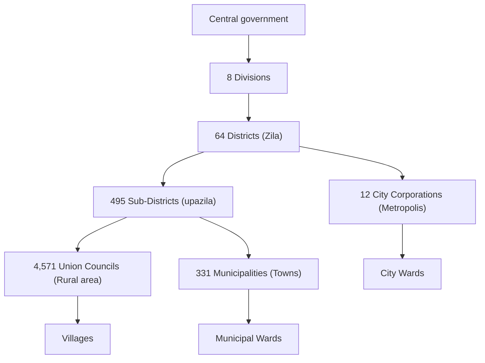
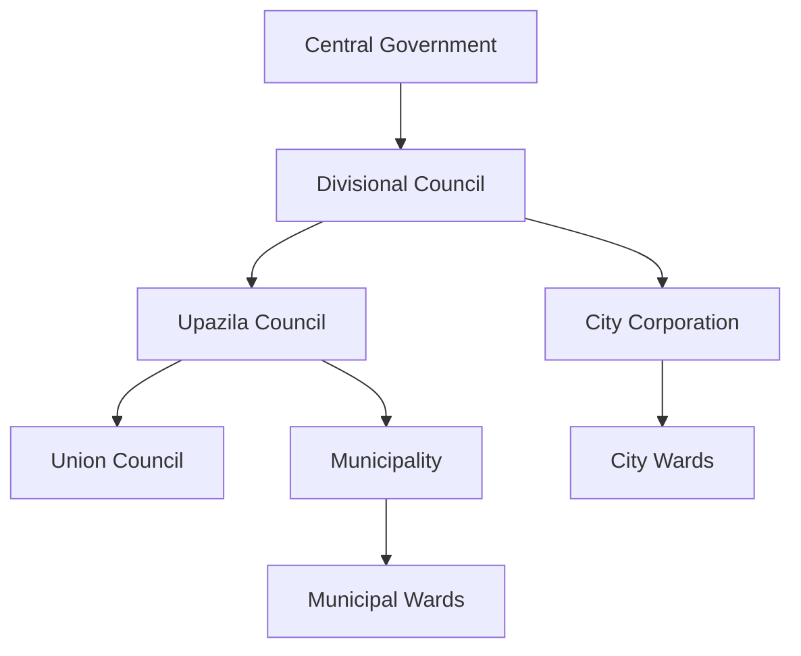

# Decentralization of Executive Power

## Executive Summary

TBD

## Preamble

Over the course of last decade as fascism rose in Bangladesh what I observed most closely is, the decision making or problem/crisis solving lies with one position the Prime Minister - who happens to also be the president of the ruling political party, and only her interference will get things done. This raised my curiosity and I searched for books on it and came across the following:

* **"The Origins of Totalitarianism" by Hannah Arendt:**2 Examines the rise of totalitarian regimes, arguing that centralized power, along with mass propaganda and the destruction of civil society, created fertile ground for totalitarianism.
* **"How Fascism Works" by Jason Stanley:**3 Analyzes core features of fascism, demonstrating how centralized power allows fascist leaders to consolidate control and weaken democratic institutions.
* **"The Anatomy of Fascism" by Robert O. Paxton:**4 Provides a historical and comparative analysis of fascism, highlighting centralized power as a crucial enabling factor.
* **"On Tyranny" by Timothy Snyder:**5 Offers a practical guide to resisting authoritarianism, emphasizing the need to defend democratic institutions and oppose the concentration of power.

Then further reading into the topic I came across the quote -

> The one purposive and systematic development clear in this
history of the transformation of the Weimar Constitution is the unification of power and its centralization in the hands of the Leader and Reich Chancellor6.

The literary evidence over generations makes it clear that the idea of a **Supreme Me** comes as more decision making is centralized! There is tons of similar examples in large business organizations as well!

In Bangladesh the fate of any individuals living outside of city corporations is in the hands of Member of Parliaments (MP) in terms of the development activities that is happening in their constituency. Furthermore, for logical reason the MP has to be based out of the capital city because of parliamentary sessions, parliamentary committee commitments. Leaving them mostly detached from their constituency. From a Fascism point of view, 300 MPs, 12 City Mayors is all it takes to control the country! So oppressing opposition also becomes easy, as number of people to control is small.

We will also discover how decentralization helps with transparency and curbing of corruption in a separate proposal.

So we want to break the hegemony of decision making in Bangladesh and engage as many as people as possible! So we will later look into the administrative geography, how we want to leverage it, what does the local government structure look like and at what hierarchy, their tenure and decisions onboard!

## Ministries of Bangladesh and Local Representation

We have a lot of ministries, it is not reasonable or rationale to have representative at the local government level in a 1 to 1 basis. So instead this proposal recommends that we group the ministries into the following groups:

* Governance and Administration
* Finance
* Agriculture
* Industry and Commerce
* Transportation
* Education
* Social Welfare and Culture
* Social Development

Local government councils will have elected representatives for each of the positions at the different levels. Given that each of the representative is a grouping of ministries; proposal is that local government elected positions are a full time position.

The ministries that would not have local government representation are -

* Ministry of Cabinet Affairs
* Ministry of Chittagong Hill Tracts Affairs
* Ministry of Defense
* Ministry of Foreign Affairs
* Ministry of Public Administration

The following is a proposal of how we could group our ministries to that of the above -

* Governance and Administration
  * Ministry of Electricity, Energy and Mineral Resources
  * Ministry of Home Affairs
  * Ministry of Law, Justice and Parliamentary Affairs
  * Ministry of Liberation War Affairs
  * Ministry of Local Government, Rural Development & Co-operatives
* Economic Development
  * Finance:
    * Ministry of Finance
    * Ministry of Expatriates' Welfare and Overseas Employment
  * Agro:
    * Ministry of Agriculture
    * Ministry of Fisheries and Livestock
    * Ministry of Food
    * Ministry of Land
    * Ministry of Water Resources
  * Industry and Commerce:
    * Ministry of Commerce
    * Ministry of Industries
    * Ministry of Jute and Textiles
    * Ministry of Labour and Employment
    * Ministry of Maritime Affairs
    * Ministry of Planning
  * Transportation:
    * Ministry of Communications
    * Ministry of Civil Aviation and Tourism
    * Ministry of Railways
    * Ministry of Road Transport and Bridges
    * Ministry of Shipping
* Social Development
  * Education:
    * Ministry of Education
    * Ministry of Primary and Mass Education
  * Social Welfare and Culture:
    * Ministry of Cultural Affairs
    * Ministry of Health and Family Welfare
    * Ministry of Social Welfare
    * Ministry of Women and Children Affairs
  * Ministry of Disaster Management and Relief
  * Ministry of Environment, Forest and Climate Change
  * Ministry of Religious Affairs
  * Ministry of Youth and Sports
* Communication and Technology
  * Ministry of Information and Broadcasting
  * Ministry of Information and Communication Technology
  * Ministry of Post and Telecommunications
  * Ministry of Science and Technology

## Administrative Geography: Today and in Future

The administrative structure of Bangladesh1 today looks like -

We already have elected representation for Municipalties, City Corporations and Union Councils. But their functions are not fully stuffed to function uniformly and are also concentration of power!

For example, take a City Corporation; it elects a Mayor who is supposed to govern the city with bureaucracy; that means a single person looking into all the ministries at the City Corporation level which is utterly impossible and also concentrates too much power within that position. As an obvious result there is lack of transparency. Have a look at a Upazila Parishad annual [statement](https://mirsharai.chittagong.gov.bd/bn/site/page/Annual-Financial-Statement--2022-2023-) here7; here are my observations -

1. All the numbers are denominations of 1,000
1. Number formatting is inconsistent showing lack of professionalism
1. There is no correlation of goal vs actual
1. There is no rationalization or details about any expense or why central government granted the money
1. Telephone bill is identical for 2 financial year and furthermore, the amount is 1.1 million taka per year which is purely absurd!

These show very clearly how rigging and corruption can be done without proper transparency!

### Structure Proposal

So proposal is keeping the Union Council and City Wards as they are. In addition we are recommending change from mayoral system to **City Corporation Council** and change to **Upazila Council**. In both examples we need the council to represent the council members as stated in the previous section. Furthermore, there has to be election for each council seat specifically rather than a generic single authority!

In addition to Upazila and City Corporation Councils, this proposal also wants to introduce **Divisional Council**. Divisional Council will be responsible for coordinating across the division's respective seat! For example, _Education_ representative across Upazila's will role up to _Education_ representative at the Division level. The main reason for introducing Division council is to allow clear regional/divisional goal against national priority.

So the complete Executive Branch structure looks like -

## Execution

TBD

## Transparency

TBD

## Citations & Notes

1. The administrative structure - [Administrative geography of Bangladesh](https://en.wikipedia.org/wiki/Administrative_geography_of_Bangladesh)
1. Arendt, Hannah. *The Origins of Totalitarianism*. Harcourt, Brace & World, 1951. ISBN: 978-0-15-670153-2 
1. Stanley, Jason. *How Fascism Works: The Politics of Us and Them*. Random House, 2018. ISBN: 978-0-525-51185-4
1. Paxton, Robert O. *The Anatomy of Fascism*. Alfred A. Knopf, 2004. ISBN: 978-1-4000-4094-0
1. Snyder, Timothy. *On Tyranny: Twenty Lessons from the Twentieth Century*. Tim Duggan Books, 2017. ISBN: 978-0-804-19011-4
1. Wilson, Charles H. *The Separation of Powers under Democracy and Fascism.* Political Science Quarterly, vol. 52, no. 4, 1937, pp. 481–504. JSTOR, https://doi.org/10.2307/2143970.
1. In case the Upazila Parishad statement is removed, it is added [to the repository](../artifacts/65fc4dfea0711029516584.pdf)

**Copyright © [2024] [People of Bangladesh]**
